# Architecture

This document provides a comprehensive overview of the Rust/WASM System Monitor architecture, including component diagrams, data flows, and interaction patterns.

## Table of Contents

- [Overview](#overview)
- [System Architecture](#system-architecture)
- [Component Architecture](#component-architecture)
- [Data Flow](#data-flow)
- [Sequence Diagrams](#sequence-diagrams)
- [Build Process](#build-process)
- [Technology Stack](#technology-stack)

## Overview

The Rust/WASM System Monitor is built on a layered architecture that separates concerns between system access, WASM interoperability, and TypeScript integration. This design enables both direct WASM usage and a code-first discovery pattern for AI agents.

### Design Principles

1. **Separation of Concerns**: Clear boundaries between Rust core, WASM bindings, and TypeScript wrappers
2. **Progressive Discovery**: Zero tokens until tools are accessed
3. **Type Safety**: End-to-end type safety from Rust to TypeScript
4. **Performance First**: Optimized compilation and minimal overhead
5. **Zero Dependencies**: No external services or API keys required

## System Architecture

### High-Level Architecture

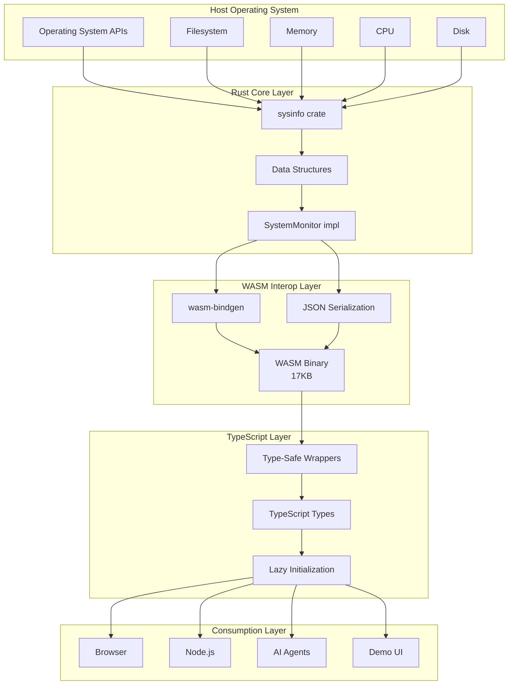

### Layer Responsibilities

#### 1. Rust Core Layer
- System information collection via `sysinfo` crate
- Data structure definitions with Serialize/Deserialize
- Business logic implementation
- Cross-platform compatibility handling

#### 2. WASM Interop Layer
- `wasm-bindgen` FFI bindings
- JSON serialization for JavaScript compatibility
- Platform-specific compilation (`#[cfg]` attributes)
- Optimized binary generation

#### 3. TypeScript Layer
- Type-safe function wrappers
- Lazy WASM initialization
- JSON parsing and type conversion
- Ergonomic API for consumers

#### 4. Consumption Layer
- Browser integration
- Node.js integration
- AI agent code-first discovery
- Interactive demo application

## Component Architecture

### Component Diagram

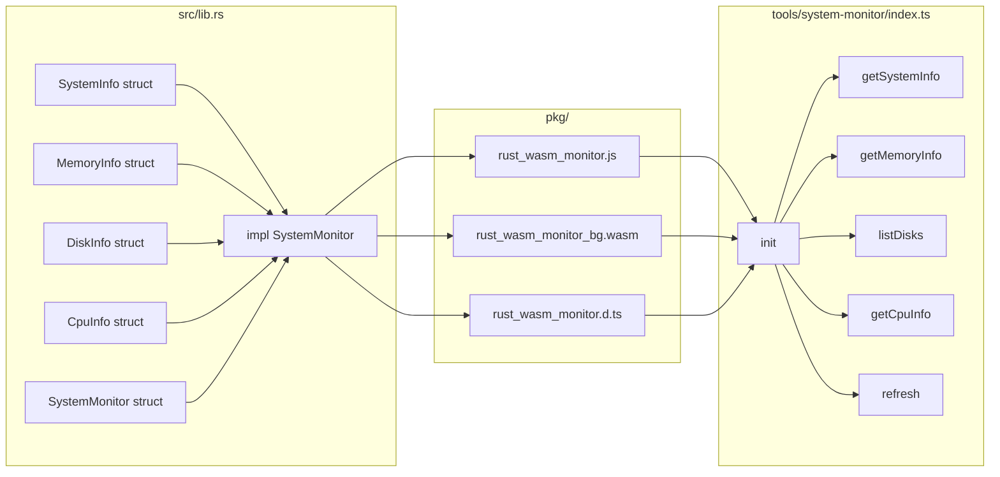

### Core Components

#### SystemMonitor (Rust)
```rust
pub struct SystemMonitor {
    #[cfg(not(target_arch = "wasm32"))]
    sys: System,
}
```
- Main entry point for system monitoring
- Wraps `sysinfo::System` on native platforms
- Empty struct on WASM target (data fetched on-demand)

#### Data Structures (Rust)
```rust
pub struct SystemInfo { ... }
pub struct MemoryInfo { ... }
pub struct DiskInfo { ... }
pub struct CpuInfo { ... }
```
- Serializable structures for cross-language communication
- JSON-compatible field types
- Comprehensive system metrics

#### TypeScript Wrappers
```typescript
export async function getSystemInfo(): Promise<SystemInfo>
export async function getMemoryInfo(): Promise<MemoryInfo>
export async function listDisks(): Promise<DiskInfo[]>
export async function getCpuInfo(): Promise<CpuInfo[]>
```
- Type-safe async functions
- Automatic JSON parsing
- Lazy WASM initialization

## Data Flow

### Initialization Flow

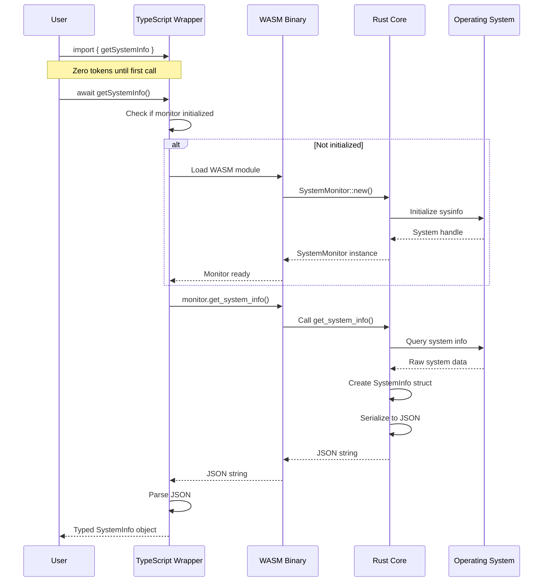

### Data Collection Flow

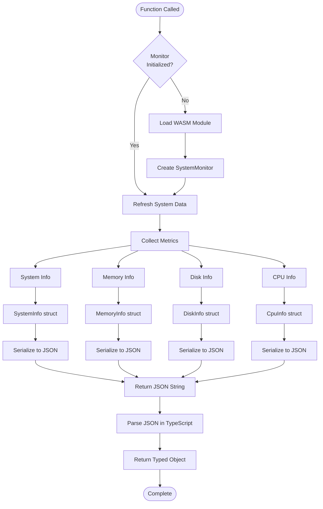

## Sequence Diagrams

### AI Agent Discovery Pattern

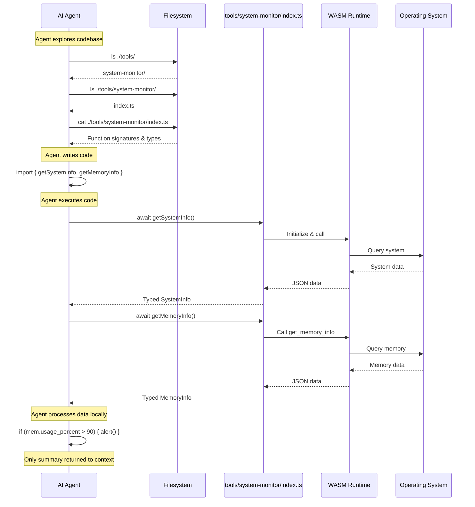

### Browser Usage Flow

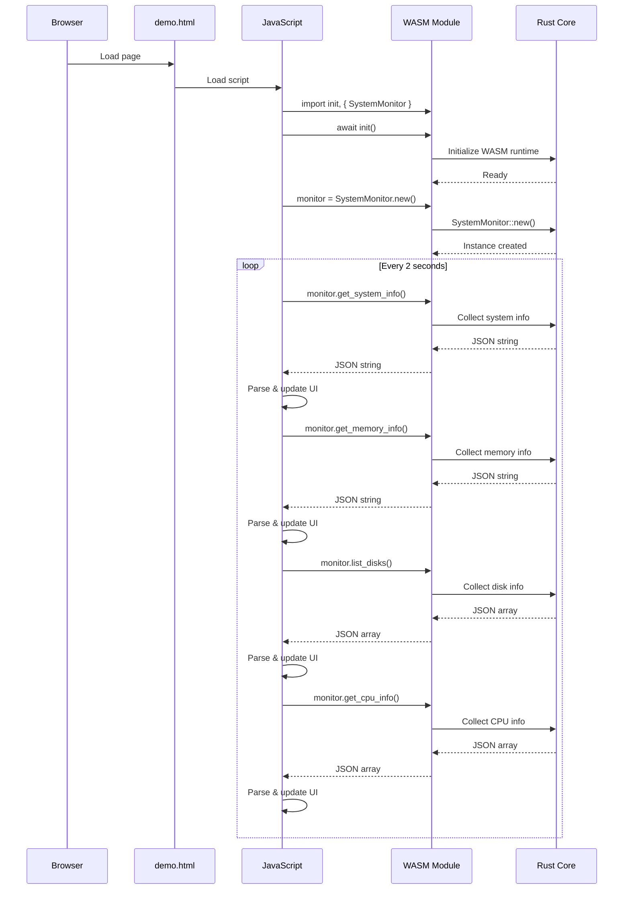

## Build Process

### Build Pipeline

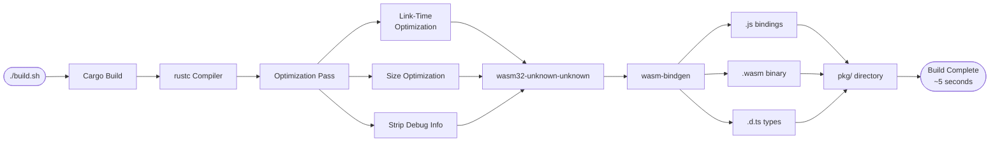

### Build Optimization Flow

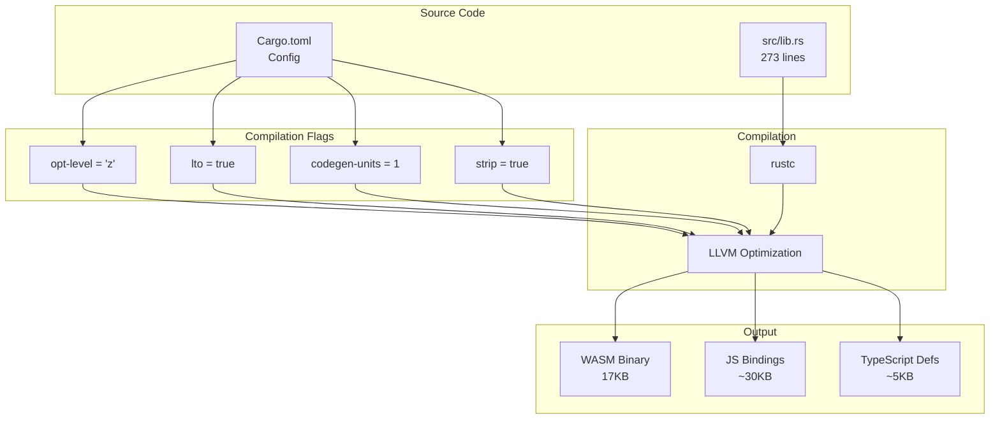

## Technology Stack

### Language & Runtime
- **Rust**: 2024 edition for core implementation
- **WebAssembly**: wasm32-unknown-unknown target
- **TypeScript**: Type-safe wrapper layer
- **JavaScript**: ES6+ modules

### Key Dependencies

#### Rust
- `sysinfo` (0.33.0): Cross-platform system information
- `wasm-bindgen` (0.2): Rust/WASM/JavaScript interop
- `serde` (1.0): Serialization framework
- `serde_json` (1.0): JSON serialization

#### Build Tools
- `cargo`: Rust build system
- `wasm-pack`: WASM build tool
- `rustc`: Rust compiler
- `LLVM`: Optimization backend

### Platform Support

#### Native Platforms (via sysinfo)
- Linux (all distributions)
- macOS (10.10+)
- Windows (7+)
- FreeBSD
- Other Unix-like systems

#### WASM Platforms
- Modern browsers (Chrome, Firefox, Safari, Edge)
- Node.js (with WASM support)
- Deno
- Browser extensions

## Performance Characteristics

### Build Performance
- **Compilation Time**: ~5 seconds (release build)
- **Binary Size**: 17KB (WASM, optimized)
- **JS Bindings Size**: ~30KB
- **TypeScript Defs**: ~5KB

### Runtime Performance
- **Initialization**: <100ms first call
- **Subsequent Calls**: <10ms
- **Memory Overhead**: <1MB
- **CPU Overhead**: Negligible

### Token Efficiency
- **Traditional MCP**: ~150,000 tokens
- **Code-First**: ~2,000 tokens
- **Reduction**: 98.7%

## Security Considerations

### Sandboxing
- WASM runs in browser security sandbox
- No filesystem access beyond what OS provides
- No network access in core library
- Read-only system information queries

### Data Privacy
- All data processing happens locally
- No external API calls
- No telemetry or tracking
- Data never leaves execution environment

### Type Safety
- Rust's type system prevents memory unsafety
- TypeScript provides compile-time type checking
- JSON schema validation via serde
- No runtime type coercion errors

## Extensibility

### Adding New Metrics

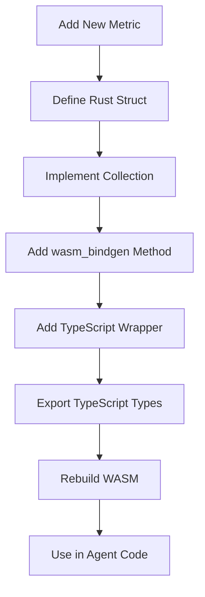

### Extension Points

1. **Rust Core**: Add new data structures and collection methods
2. **WASM Bindings**: Expose new methods via `#[wasm_bindgen]`
3. **TypeScript Layer**: Create type-safe wrappers
4. **Discovery**: New tools automatically discoverable by agents

## Comparison with Traditional Architectures

### Traditional MCP Architecture

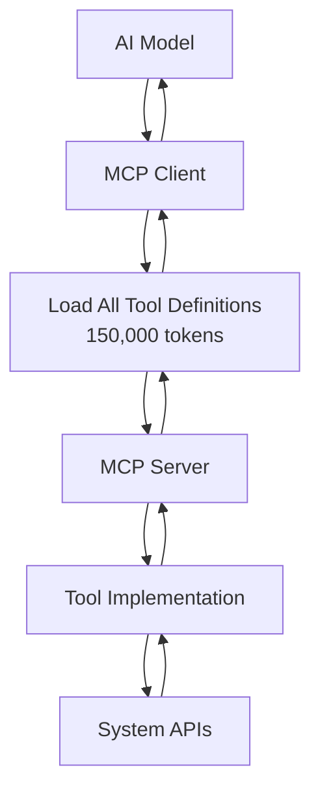

### Code-First Architecture

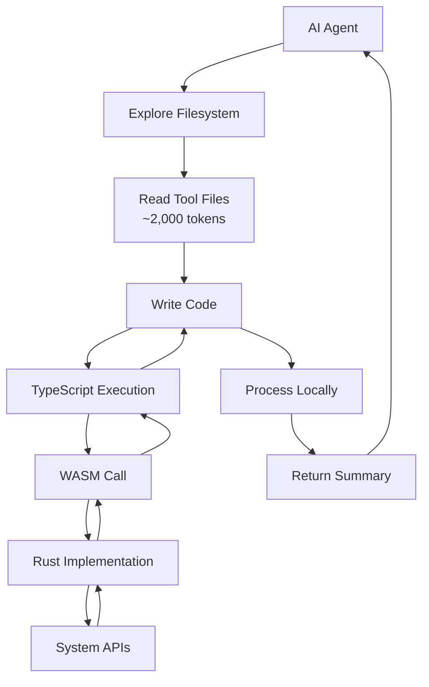

## Related Documentation

- [Core Components](Core-Components.md) - Detailed Rust implementation
- [TypeScript Integration](TypeScript-Integration.md) - TypeScript wrapper details
- [Build System](Build-System.md) - Build process and optimization
- [Code-First Approach](Code-First-Approach.md) - Discovery pattern details

---

[Back to Home](Home.md)
