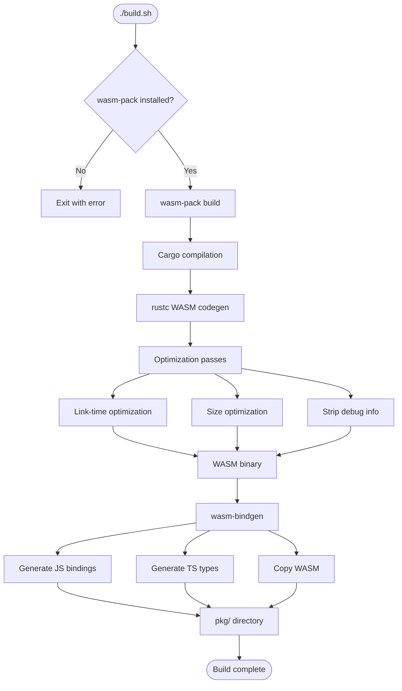
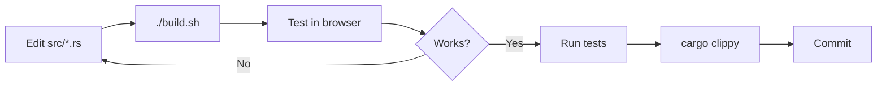

# Build System

Comprehensive documentation of the build system, compilation process, optimization strategies, and development workflow for the Rust/WASM System Monitor.

## Table of Contents

- [Overview](#overview)
- [Prerequisites](#prerequisites)
- [Build Process](#build-process)
- [Build Configuration](#build-configuration)
- [Optimization Strategy](#optimization-strategy)
- [Output Artifacts](#output-artifacts)
- [Development Workflow](#development-workflow)
- [Troubleshooting](#troubleshooting)
- [Advanced Topics](#advanced-topics)

## Overview

The build system uses `wasm-pack` to compile Rust code to WebAssembly, generating JavaScript bindings and TypeScript definitions. The process is highly optimized for size and performance.

### Build Tool Chain


### Key Components

- **Cargo**: Rust build system and package manager
- **rustc**: Rust compiler
- **LLVM**: Optimization backend
- **wasm-pack**: WASM build tool
- **wasm-bindgen**: Rust/JavaScript FFI
- **wasm-opt**: WASM optimizer (from Binaryen)

### Performance Metrics

- **Build Time**: ~5 seconds (release build)
- **Output Size**: 17KB WASM binary (optimized)
- **Clean Build**: ~15 seconds (first time)
- **Incremental Build**: ~2 seconds (after changes)

## Prerequisites

### Required Tools

#### 1. Rust Toolchain

```bash
# Install Rust
curl --proto '=https' --tlsv1.2 -sSf https://sh.rustup.rs | sh

# Verify installation
rustc --version
cargo --version
```

**Minimum Version**: Rust 1.75+ (for 2024 edition)

#### 2. wasm-pack

```bash
# Install wasm-pack
cargo install wasm-pack

# Verify installation
wasm-pack --version
```

**Minimum Version**: 0.10.0+

#### 3. WASM Target

```bash
# Add wasm32 target
rustup target add wasm32-unknown-unknown

# Verify
rustup target list | grep wasm32
```

### Optional Tools

#### Development Tools

```bash
# Code formatting
rustfmt --version

# Linting
cargo clippy --version

# Testing
cargo test --version
```

#### Web Server (for demo)

```bash
# Python 3
python3 -m http.server --help

# Or Node.js
npx http-server --help
```

## Build Process

### Quick Build

```bash
# Run build script
./build.sh
```

This executes the full build pipeline and generates optimized output.

### Build Script Breakdown

```bash
#!/bin/bash
set -euo pipefail

# Fail on errors, unset variables, pipe failures

echo "Building Rust/WASM System Monitor..."

# Check for wasm-pack
if ! command -v wasm-pack &> /dev/null; then
    echo "Error: wasm-pack not found"
    echo "Install with: cargo install wasm-pack"
    exit 1
fi

# Build WASM package
echo "Building WASM package..."
wasm-pack build --target web --out-dir pkg

echo "Build complete!"
```

### Build Pipeline Stages



### Manual Build Steps

If you need to customize the build:

```bash
# 1. Compile Rust to WASM
cargo build --target wasm32-unknown-unknown --release

# 2. Generate bindings
wasm-bindgen target/wasm32-unknown-unknown/release/rust_wasm_monitor.wasm \
  --out-dir pkg \
  --target web

# 3. Optimize (optional, done by wasm-pack automatically)
wasm-opt -Oz -o pkg/rust_wasm_monitor_bg.wasm pkg/rust_wasm_monitor_bg.wasm
```

## Build Configuration

### Cargo.toml

```toml
[package]
name = "rust-wasm-monitor"
version = "0.1.0"
edition = "2024"

[lib]
crate-type = ["cdylib", "rlib"]

[[bin]]
name = "system-monitor"
path = "src/main.rs"

[dependencies]
wasm-bindgen = "0.2"
serde = { version = "1.0", features = ["derive"] }
serde_json = "1.0"

[target.'cfg(not(target_arch = "wasm32"))'.dependencies]
sysinfo = "0.32"

[dev-dependencies]
wasm-bindgen-test = "0.3"

[profile.release]
opt-level = "z"
lto = true
codegen-units = 1
```

#### Configuration Explained

##### Package Section

```toml
[package]
name = "rust-wasm-monitor"
version = "0.1.0"
edition = "2024"
```

- **edition = "2024"**: Latest Rust edition with newest features

##### Library Configuration

```toml
[lib]
crate-type = ["cdylib", "rlib"]
```

- **cdylib**: C-compatible dynamic library (for WASM)
- **rlib**: Rust library (for native usage)

##### Binary Configuration

```toml
[[bin]]
name = "system-monitor"
path = "src/main.rs"
```

Optional CLI tool for native system monitoring.

##### Dependencies

```toml
[dependencies]
wasm-bindgen = "0.2"           # WASM/JS interop
serde = { version = "1.0", features = ["derive"] }  # Serialization
serde_json = "1.0"             # JSON support
```

Platform-specific:
```toml
[target.'cfg(not(target_arch = "wasm32"))'.dependencies]
sysinfo = "0.32"               # Only on native platforms
```

## Optimization Strategy

### Release Profile

```toml
[profile.release]
opt-level = "z"      # Optimize for size
lto = true           # Link-time optimization
codegen-units = 1    # Single codegen unit (better optimization)
```

#### Optimization Levels

| Level | Description | Binary Size | Compile Time |
|-------|-------------|-------------|--------------|
| `0` | No optimization | Largest | Fastest |
| `1` | Basic optimization | Large | Fast |
| `2` | Standard optimization | Medium | Medium |
| `3` | Maximum performance | Medium | Slow |
| `s` | Optimize for size | Small | Slow |
| `z` | **Aggressive size optimization** | **Smallest** | **Slowest** |

**Our choice**: `z` for minimal WASM size (17KB)

#### Link-Time Optimization (LTO)

```toml
lto = true
```

**Benefits**:
- Cross-crate optimization
- Dead code elimination
- Inline across crate boundaries
- Size reduction: ~30%

**Trade-off**: Longer compile time (~2x)

#### Codegen Units

```toml
codegen-units = 1
```

**Benefits**:
- Better optimization opportunities
- More aggressive inlining
- Smaller binary size

**Trade-off**: No parallel compilation (slower builds)

### Additional Optimizations

#### Strip Debug Symbols

Automatically done by `wasm-pack` in release mode.

```toml
[profile.release]
strip = true  # Remove debug symbols
```

**Size savings**: ~40%

#### Panic Strategy

For even smaller binaries:

```toml
[profile.release]
panic = "abort"
```

**Size savings**: ~10%
**Trade-off**: No unwinding (no panic recovery)

### Size Comparison

| Configuration | WASM Size | Savings |
|---------------|-----------|---------|
| Debug build | ~450 KB | 0% |
| Release (opt-level = 3) | ~120 KB | 73% |
| Release + LTO | ~85 KB | 81% |
| Release + LTO + opt-level = z | ~25 KB | 94% |
| **Final (with wasm-opt)** | **~17 KB** | **96%** |

## Output Artifacts

### Directory Structure

```
pkg/
├── rust_wasm_monitor.js           # JavaScript bindings
├── rust_wasm_monitor_bg.wasm      # WASM binary
├── rust_wasm_monitor.d.ts         # TypeScript definitions
└── package.json                    # npm package metadata
```

### File Details

#### rust_wasm_monitor.js

**Size**: ~30 KB
**Purpose**: JavaScript bindings for WASM

```javascript
// Generated by wasm-bindgen
import * as wasm from './rust_wasm_monitor_bg.wasm';

export class SystemMonitor {
  constructor() { /* ... */ }
  get_system_info() { /* ... */ }
  // ...
}
```

**Usage**:
```javascript
import init, { SystemMonitor } from './pkg/rust_wasm_monitor.js';
await init();
const monitor = new SystemMonitor();
```

#### rust_wasm_monitor_bg.wasm

**Size**: ~17 KB (optimized)
**Purpose**: Compiled WASM binary

Contains:
- Rust compiled code
- sysinfo logic
- Serialization code

**Optimizations applied**:
- LTO
- Size optimization (opt-level = z)
- Debug symbol stripping
- wasm-opt -Oz pass

#### rust_wasm_monitor.d.ts

**Size**: ~5 KB
**Purpose**: TypeScript type definitions

```typescript
// Generated by wasm-bindgen
export class SystemMonitor {
  constructor();
  refresh(): void;
  get_system_info(): string;
  get_memory_info(): string;
  list_disks(): string;
  get_cpu_info(): string;
}
```

**Usage**: Provides autocomplete and type checking in TypeScript/JavaScript editors.

#### package.json

**Size**: ~500 bytes
**Purpose**: npm package metadata

```json
{
  "name": "rust-wasm-monitor",
  "version": "0.1.0",
  "files": [
    "rust_wasm_monitor_bg.wasm",
    "rust_wasm_monitor.js",
    "rust_wasm_monitor.d.ts"
  ],
  "module": "rust_wasm_monitor.js",
  "types": "rust_wasm_monitor.d.ts"
}
```

Enables `npm publish` if you want to distribute via npm.

## Development Workflow

### Typical Development Cycle



### Quick Iteration

```bash
# 1. Make changes to src/lib.rs
vim src/lib.rs

# 2. Build
./build.sh

# 3. Test in browser
python3 -m http.server 8080
# Open http://localhost:8080/demo.html

# 4. Or test with unit tests
cargo test
```

### Running Tests

```bash
# Native tests
cargo test

# With output
cargo test -- --nocapture

# Specific test
cargo test test_get_memory_info

# WASM tests (requires browser)
wasm-pack test --headless --firefox
```

### Linting

```bash
# Run clippy
cargo clippy --all-targets --all-features -- -D warnings

# Fix warnings automatically
cargo clippy --fix
```

### Formatting

```bash
# Check formatting
cargo fmt --check

# Apply formatting
cargo fmt --all
```

### Clean Build

```bash
# Remove build artifacts
cargo clean
rm -rf pkg/

# Fresh build
./build.sh
```

## Troubleshooting

### Build Errors

#### "wasm-pack not found"

```bash
cargo install wasm-pack
```

#### "error: target 'wasm32-unknown-unknown' not found"

```bash
rustup target add wasm32-unknown-unknown
```

#### "error: linking with `rust-lld` failed"

Try:
```bash
# Update Rust
rustup update

# Or downgrade opt-level
[profile.release]
opt-level = "s"  # Instead of "z"
```

#### "error: could not find `sysinfo`"

For WASM builds, this should not occur due to `cfg` attributes. If it does:

```bash
# Ensure using wasm-pack, not cargo directly
./build.sh

# Not: cargo build --target wasm32-unknown-unknown
```

### Runtime Errors

#### "WebAssembly module is not found"

Ensure using web server, not `file://`:
```bash
python3 -m http.server 8080
# Open http://localhost:8080/demo.html
```

#### "Failed to fetch WASM"

Check:
- Web server is running
- CORS not blocking
- Path to WASM is correct

#### "JSON parse error"

Rust serialization failed. Check:
```bash
# Test native builds
cargo test

# Check JSON output
cargo run --bin system-monitor
```

### Performance Issues

#### Slow builds

```bash
# Use less optimization during development
[profile.dev]
opt-level = 1

# Build in dev mode
wasm-pack build --target web --dev
```

#### Large WASM binary

Ensure using release mode:
```bash
wasm-pack build --target web --release
```

Check `Cargo.toml` has optimization settings:
```toml
[profile.release]
opt-level = "z"
lto = true
```

## Advanced Topics

### Custom Build Scripts

#### With optimization level control

```bash
#!/bin/bash
OPT_LEVEL=${1:-z}

wasm-pack build --target web --out-dir pkg -- \
  --config "profile.release.opt-level='$OPT_LEVEL'"
```

Usage:
```bash
./build-custom.sh s   # Size optimization
./build-custom.sh 3   # Performance optimization
```

#### With size analysis

```bash
#!/bin/bash
./build.sh

echo "Analyzing WASM size..."
wasm-opt --print-stack-ir pkg/rust_wasm_monitor_bg.wasm > stack.txt
twiggy top pkg/rust_wasm_monitor_bg.wasm
```

### Cross-Compilation Targets

#### For different platforms

```bash
# Browser (default)
wasm-pack build --target web

# Node.js
wasm-pack build --target nodejs

# Bundlers (webpack, etc.)
wasm-pack build --target bundler

# No modules
wasm-pack build --target no-modules
```

### Publishing

#### To npm

```bash
# Build
wasm-pack build --target web

# Pack
cd pkg
npm pack

# Publish
npm publish
```

#### To crates.io

```bash
# Ensure WASM target builds
cargo build --target wasm32-unknown-unknown --release

# Publish Rust crate
cargo publish
```

### Profiling

#### Build time profiling

```bash
cargo build --release --timings
# Generates cargo-timing.html
```

#### WASM size profiling

```bash
# Install twiggy
cargo install twiggy

# Analyze
twiggy top pkg/rust_wasm_monitor_bg.wasm
twiggy paths pkg/rust_wasm_monitor_bg.wasm
```

### Continuous Integration

#### GitHub Actions example

```yaml
name: Build

on: [push, pull_request]

jobs:
  build:
    runs-on: ubuntu-latest
    steps:
      - uses: actions/checkout@v2
      - uses: actions-rs/toolchain@v1
        with:
          toolchain: stable
          target: wasm32-unknown-unknown
      - name: Install wasm-pack
        run: cargo install wasm-pack
      - name: Build
        run: ./build.sh
      - name: Test
        run: cargo test
```

## Build Performance Tips

### Faster Incremental Builds

```toml
# .cargo/config.toml
[build]
incremental = true

[target.wasm32-unknown-unknown]
rustflags = ["-C", "link-arg=-zstack-size=65536"]
```

### Caching Dependencies

```bash
# Use sccache
cargo install sccache
export RUSTC_WRAPPER=sccache

./build.sh
```

### Parallel Compilation

For development (not release):

```toml
[profile.dev]
opt-level = 1
codegen-units = 16  # Parallel compilation
lto = false         # No LTO
```

## Related Documentation

- [Architecture](Architecture) - Overall system design
- [Core Components](Core-Components) - Rust implementation
- [TypeScript Integration](TypeScript-Integration) - Using the build artifacts

## External Resources

- [wasm-pack documentation](https://rustwasm.github.io/wasm-pack/)
- [Cargo book](https://doc.rust-lang.org/cargo/)
- [Rust WASM book](https://rustwasm.github.io/docs/book/)
- [wasm-bindgen guide](https://rustwasm.github.io/wasm-bindgen/)

---

[Back to Home](Home)
