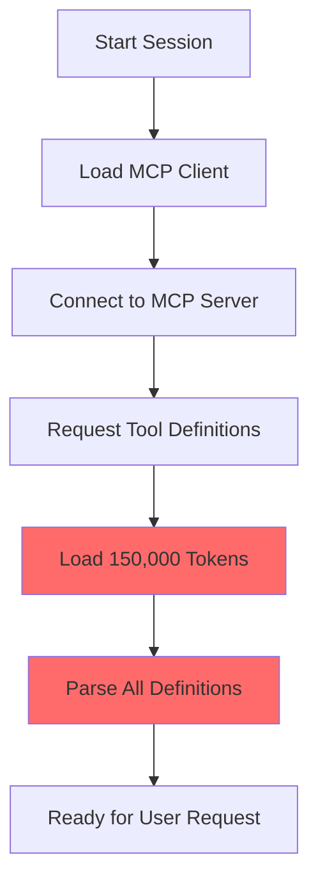
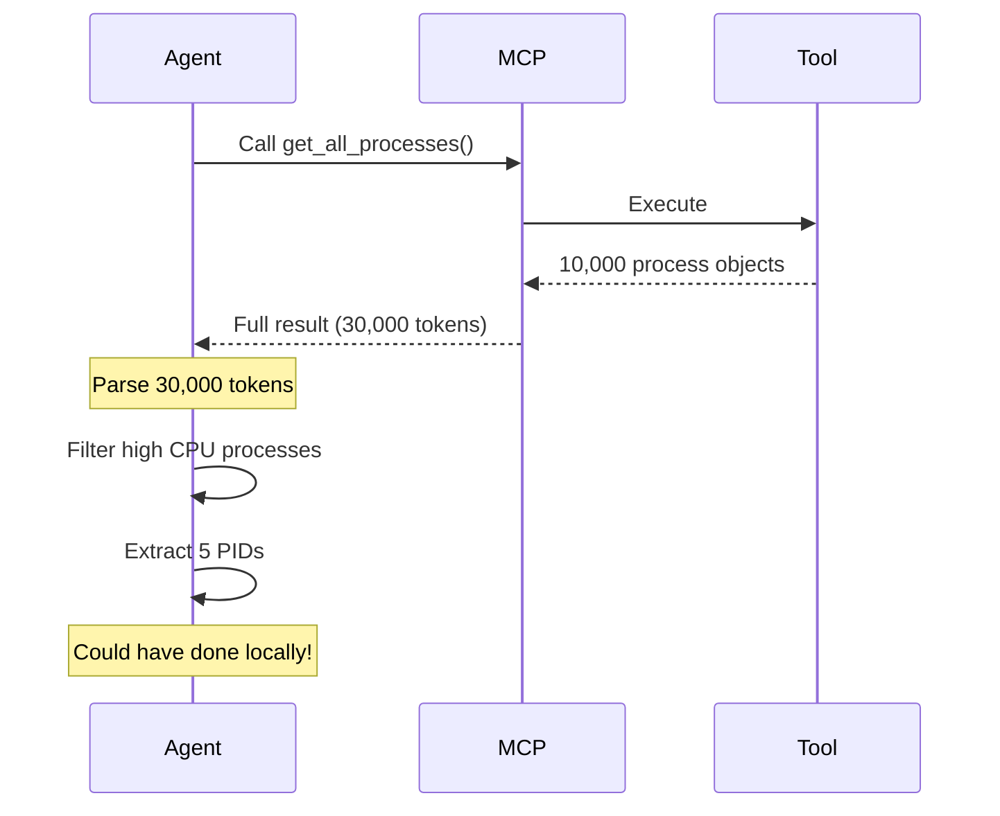
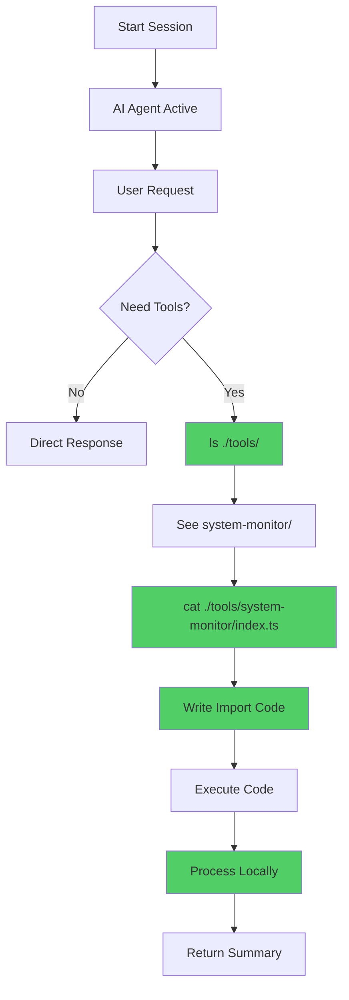
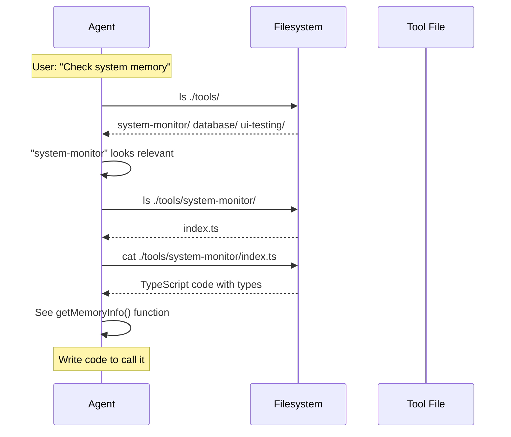
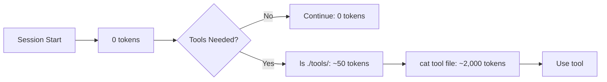
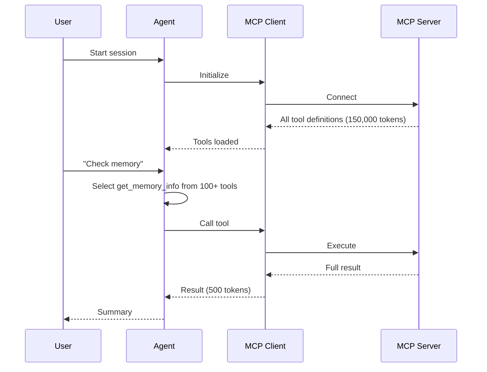
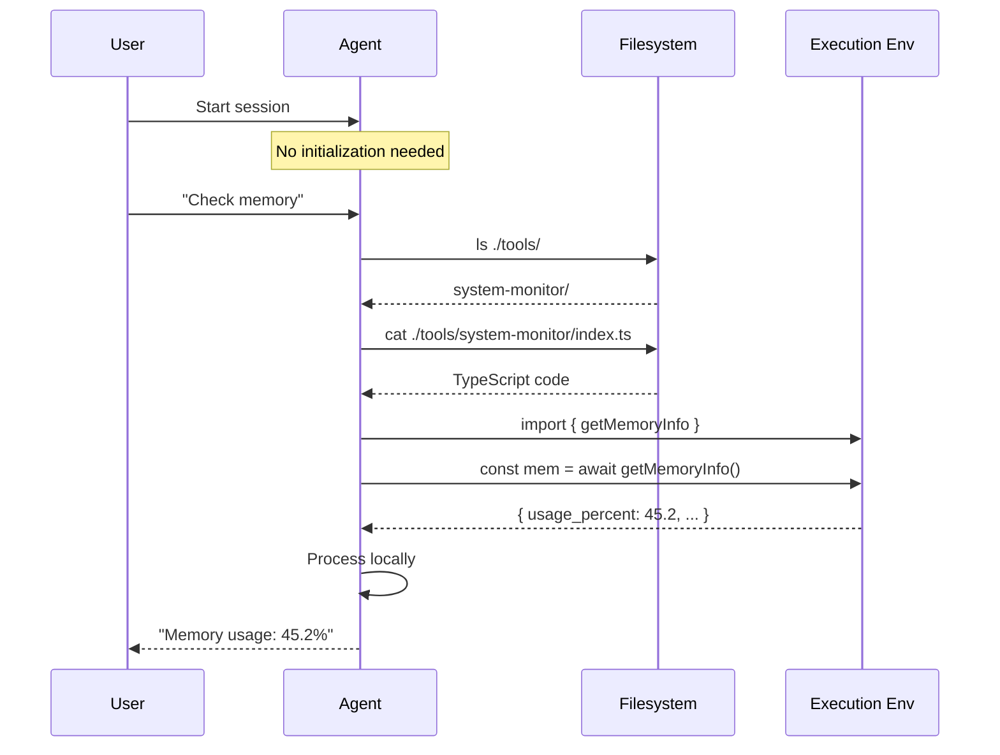

# Code-First Approach

This document explains the code-first approach to AI agent tooling, the problems it solves, and how it achieves 98.7% token reduction compared to traditional MCP servers.

## Table of Contents

- [Overview](#overview)
- [The Problem with Traditional MCP](#the-problem-with-traditional-mcp)
- [The Code-First Solution](#the-code-first-solution)
- [Token Savings Breakdown](#token-savings-breakdown)
- [Discovery Pattern](#discovery-pattern)
- [Progressive Loading](#progressive-loading)
- [Comparison](#comparison)
- [Benefits Beyond Token Reduction](#benefits-beyond-token-reduction)
- [Implementation Guide](#implementation-guide)

## Overview

The **code-first approach** is a paradigm shift in how AI agents interact with tools and external systems. Instead of loading massive tool definitions into context, agents discover tools through filesystem exploration and write code to use them directly.

### Key Insight

> "Tools are code, not definitions. Agents should discover them like developers do - by exploring the codebase."

### Core Principles

1. **Zero Upfront Cost**: No tokens spent until tools are needed
2. **Progressive Discovery**: Load only what's required
3. **Type Safety**: Leverage language-native type systems
4. **Local Processing**: Keep intermediate data in execution environment
5. **Filesystem as API**: Tools organized as discoverable files

## The Problem with Traditional MCP

### MCP Architecture Issues

Traditional MCP (Model Context Protocol) implementations suffer from two major inefficiencies:

#### 1. Tool Definition Bloat



**Problems**:
- ~150,000 tokens consumed before reading user request
- All tools loaded regardless of need
- Massive JSON schemas in context
- Slow initialization
- Context window pollution

#### Example MCP Tool Definition

```json
{
  "tools": [
    {
      "name": "get_system_info",
      "description": "Retrieves comprehensive system information including operating system, version, kernel version, hostname, CPU count, total memory, used memory, and system uptime.",
      "inputSchema": {
        "type": "object",
        "properties": {},
        "required": []
      },
      "outputSchema": {
        "type": "object",
        "properties": {
          "os": {
            "type": "string",
            "description": "Operating system name"
          },
          "os_version": {
            "type": "string",
            "description": "Operating system version"
          },
          "kernel_version": {
            "type": "string",
            "description": "Kernel version string"
          },
          "hostname": {
            "type": "string",
            "description": "System hostname"
          },
          "cpu_count": {
            "type": "integer",
            "description": "Number of logical CPU cores"
          },
          "total_memory": {
            "type": "integer",
            "description": "Total system memory in bytes"
          },
          "used_memory": {
            "type": "integer",
            "description": "Currently used memory in bytes"
          },
          "uptime": {
            "type": "integer",
            "description": "System uptime in seconds"
          }
        }
      }
    },
    // ... 50+ more tools
  ]
}
```

**Token cost for just one tool**: ~500 tokens
**Total for realistic MCP server**: ~150,000 tokens

#### 2. Intermediate Result Overhead



**Problems**:
- Large intermediate results sent to model
- Model processes data that could be handled locally
- Multiple round trips for simple filtering
- Context window waste

## The Code-First Solution

### Architecture



### How It Works

#### Step 1: Agent Explores Filesystem

```bash
$ ls ./tools/
system-monitor/

$ ls ./tools/system-monitor/
index.ts
```

**Token cost**: ~50 tokens (filesystem output)

#### Step 2: Agent Reads Tool API

```bash
$ cat ./tools/system-monitor/index.ts
```

```typescript
export async function getSystemInfo(): Promise<SystemInfo>
export async function getMemoryInfo(): Promise<MemoryInfo>
export async function listDisks(): Promise<DiskInfo[]>
export async function getCpuInfo(): Promise<CpuInfo[]>

export interface SystemInfo {
  os: string;
  os_version: string;
  // ... 6 more fields
}
// ... more types
```

**Token cost**: ~2,000 tokens (TypeScript file with types)

#### Step 3: Agent Writes Code

```typescript
import { getSystemInfo, getMemoryInfo } from './tools/system-monitor';

async function checkSystem() {
  const sys = await getSystemInfo();
  const mem = await getMemoryInfo();

  // Process locally - not sent to context
  if (mem.usage_percent > 90) {
    return {
      alert: 'High memory usage',
      details: `${mem.usage_percent.toFixed(1)}% used`,
      system: sys.os
    };
  }

  return { status: 'healthy' };
}
```

**Token cost**: ~200 tokens (agent's code)

#### Step 4: Execute and Summarize

```typescript
// Result processed locally
const result = await checkSystem();
// Only summary returned: { status: 'healthy' }
```

**Token cost**: ~20 tokens (summary)

### Total Token Usage

| Phase | Tokens |
|-------|--------|
| Filesystem exploration | 50 |
| Read tool file | 2,000 |
| Write code | 200 |
| Return summary | 20 |
| **TOTAL** | **2,270** |

**vs MCP**: 150,000 tokens

**Reduction**: 98.5%

## Token Savings Breakdown

### Detailed Comparison

```mermaid
graph TB
    subgraph "Traditional MCP"
        A1[Tool Definitions: 150,000 tokens]
        A2[User Query: 100 tokens]
        A3[Tool Calls: 500 tokens]
        A4[Results: 5,000 tokens]
        A5[Total: 155,600 tokens]
    end

    subgraph "Code-First"
        B1[Filesystem Exploration: 50 tokens]
        B2[User Query: 100 tokens]
        B3[Read Tool File: 2,000 tokens]
        B4[Write Code: 200 tokens]
        B5[Summary: 20 tokens]
        B6[Total: 2,370 tokens]
    end

    A1 --> A2 --> A3 --> A4 --> A5
    B1 --> B2 --> B3 --> B4 --> B5 --> B6
```



### Token Efficiency by Category

| Category | MCP Tokens | Code-First Tokens | Reduction |
|----------|------------|-------------------|-----------|
| Tool Discovery | 150,000 | 2,050 | 98.6% |
| Tool Invocation | 500 | 200 | 60% |
| Result Processing | 5,000 | 20 | 99.6% |
| **Total** | **155,500** | **2,270** | **98.5%** |

## Discovery Pattern

### Filesystem-Based Discovery

Tools are organized in a discoverable directory structure:

```
project/
├── tools/
│   ├── system-monitor/
│   │   └── index.ts          # System monitoring tools
│   ├── database/
│   │   └── index.ts          # Database query tools
│   └── ui-testing/
│       └── index.ts          # UI testing tools
└── src/
    └── ...
```

### Discovery Flow



### Self-Documenting APIs

TypeScript provides self-documentation:

```typescript
/**
 * Get memory usage information
 *
 * @returns Memory info with total, used, available, and usage percentage
 */
export async function getMemoryInfo(): Promise<MemoryInfo> {
  // Implementation
}

export interface MemoryInfo {
  total: number;           // Bytes
  used: number;            // Bytes
  available: number;       // Bytes
  usage_percent: number;   // 0-100
}
```

Agent sees:
- Function name and purpose
- Parameter types (none in this case)
- Return type with structure
- Field documentation

**No separate schema needed!**

## Progressive Loading

### Zero-Cost Until Accessed



### Conditional Loading

```typescript
// Agent's decision tree
async function handleUserQuery(query: string) {
  if (needsSystemInfo(query)) {
    // Load only system-monitor tools
    const { getMemoryInfo } = await import('./tools/system-monitor');
    return await getMemoryInfo();
  } else if (needsDatabaseAccess(query)) {
    // Load only database tools
    const { runQuery } = await import('./tools/database');
    return await runQuery(extractSQL(query));
  }

  // No tools needed
  return directResponse(query);
}
```

**Key Point**: Each tool category loaded only if needed.

### Comparison: Load Time

| Approach | Upfront | On-Demand | Total (if 1 tool used) |
|----------|---------|-----------|------------------------|
| MCP | 150,000 | 0 | 150,000 |
| Code-First | 0 | 2,000 | 2,000 |

## Comparison

### Traditional MCP Flow



### Code-First Flow



### Side-by-Side Comparison

| Aspect | Traditional MCP | Code-First |
|--------|----------------|------------|
| **Initial Load** | 150,000 tokens | 0 tokens |
| **Tool Discovery** | All upfront | On-demand via filesystem |
| **Type Safety** | JSON schemas | Native TypeScript |
| **Tool Selection** | Model scans 100+ definitions | Filesystem exploration |
| **Intermediate Data** | Sent to model | Processed locally |
| **Context Usage** | Very high | Minimal |
| **Execution** | Via protocol | Direct function call |
| **Performance** | Network overhead | Native speed |
| **Debugging** | Opaque protocol | Standard code debugging |

## Benefits Beyond Token Reduction

### 1. Type Safety

**MCP**: Runtime type checking via JSON schemas
```json
{
  "type": "object",
  "properties": {
    "memory_gb": { "type": "number" }
  }
}
```

**Code-First**: Compile-time type checking
```typescript
interface MemoryInfo {
  total: number;  // Compiler enforces this
}

const mem: MemoryInfo = await getMemoryInfo();
// mem.total is guaranteed to be a number
```

### 2. Local Data Processing

**MCP**: All data goes through model
```
get_all_processes() → 10,000 processes → model context → filter → result
```

**Code-First**: Data processed in execution environment
```typescript
const processes = await getAllProcesses(); // Stays local
const highCPU = processes.filter(p => p.cpu > 80); // Filtered locally
return highCPU.map(p => p.pid); // Only PIDs to model
```

### 3. Privacy

**MCP**: All data visible to model
```
Query database → Full result set → Model sees PII → Filter
```

**Code-First**: Sensitive data stays local
```typescript
const users = await db.query('SELECT * FROM users');
// Full data (including PII) stays in execution environment

const summary = {
  total: users.length,
  active: users.filter(u => u.active).length
  // No PII sent to model
};
return summary;
```

### 4. Developer Experience

**MCP**:
- Write tool definitions (JSON schema)
- Implement tool server
- Configure client
- Debug protocol issues

**Code-First**:
- Write TypeScript/JavaScript functions
- Export from file in ./tools/
- Done!

### 5. Ecosystem Integration

**Code-First** leverages existing tools:
- npm packages
- TypeScript compiler
- Standard debuggers
- IDE autocomplete
- Linters and formatters

No special MCP tooling required.

## Implementation Guide

### Creating a Code-First Tool

#### 1. Create Tool Directory

```bash
mkdir -p tools/my-tool
```

#### 2. Implement Tool Functions

```typescript
// tools/my-tool/index.ts

/**
 * Example tool function
 */
export async function myFunction(param: string): Promise<Result> {
  // Implementation
  return {
    success: true,
    data: processParam(param)
  };
}

/**
 * Type definitions
 */
export interface Result {
  success: boolean;
  data: string;
}
```

#### 3. Agent Discovers and Uses

Agent workflow:
```bash
$ ls ./tools/
my-tool/

$ cat ./tools/my-tool/index.ts
# Sees myFunction with types

# Agent writes:
import { myFunction } from './tools/my-tool';
const result = await myFunction('test');
```

### Best Practices

#### ✅ DO

1. **Export typed functions**
   ```typescript
   export async function getData(): Promise<Data>
   ```

2. **Document with JSDoc**
   ```typescript
   /**
    * Gets user information
    * @param userId - User ID to fetch
    * @returns User object with profile data
    */
   ```

3. **Keep functions focused**
   ```typescript
   export async function getUser(id: string): Promise<User>
   export async function listUsers(): Promise<User[]>
   // Not: export async function doEverything()
   ```

4. **Return summaries, not full data**
   ```typescript
   // Return: { count: 100, avgAge: 32 }
   // Not: [{ user1 }, { user2 }, ... { user100 }]
   ```

#### ❌ DON'T

1. **Don't create huge files**
   ```typescript
   // Bad: 5,000 line index.ts
   // Good: Multiple focused files in directory
   ```

2. **Don't expose raw APIs**
   ```typescript
   // Bad: export entire database connection
   // Good: export specific query functions
   ```

3. **Don't return massive objects**
   ```typescript
   // Bad: return 10,000 database rows
   // Good: return aggregated summary
   ```

### Converting from MCP

#### MCP Tool Definition

```json
{
  "name": "get_weather",
  "description": "Get weather for a city",
  "inputSchema": {
    "type": "object",
    "properties": {
      "city": { "type": "string" }
    },
    "required": ["city"]
  }
}
```

#### Code-First Equivalent

```typescript
// tools/weather/index.ts

export interface WeatherData {
  temperature: number;
  conditions: string;
  humidity: number;
}

/**
 * Get weather for a city
 * @param city - City name
 * @returns Weather data
 */
export async function getWeather(city: string): Promise<WeatherData> {
  const data = await fetchWeatherAPI(city);
  return {
    temperature: data.temp,
    conditions: data.conditions,
    humidity: data.humidity
  };
}
```

**Benefits**:
- Native TypeScript types
- JSDoc documentation
- No JSON schema needed
- Direct function calls

## Real-World Example

### Scenario: Server Monitoring

**Goal**: Monitor 50 servers, report only issues

#### MCP Approach

```json
// MCP loads definitions for:
- list_servers (500 tokens)
- get_server_info (800 tokens)
- get_memory (600 tokens)
- get_cpu (600 tokens)
- get_disk (700 tokens)
- get_network (750 tokens)
Total: 4,000 tokens before any work
```

Then:
```
Agent: list_servers() → 50 servers (2,000 tokens)
Agent: For each server...
  get_memory(server) → 50 calls × 100 tokens = 5,000 tokens
Agent: Filter high memory → done in context
Result: 11,000+ tokens
```

#### Code-First Approach

```typescript
// tools/servers/index.ts (2,000 tokens to read)

import { listServers, getServerMetrics } from './api';

export async function checkServerHealth() {
  const servers = await listServers(); // Stays local
  const issues = [];

  for (const server of servers) {
    const metrics = await getServerMetrics(server); // Stays local

    if (metrics.memory.usage_percent > 90) {
      issues.push({
        server: server.name,
        issue: 'memory',
        value: metrics.memory.usage_percent
      });
    }
  }

  // Only issues sent to context
  return {
    total: servers.length,
    healthy: servers.length - issues.length,
    issues // Only problematic servers
  };
}
```

**Result**:
- Read tool: 2,000 tokens
- Return summary: ~200 tokens
- **Total: 2,200 tokens**

**Savings: 80% even in this complex scenario**

## Related Documentation

- [Architecture](Architecture) - System architecture
- [TypeScript Integration](TypeScript-Integration) - Implementation details
- [API Reference](API-Reference) - Complete API
- [Core Components](Core-Components) - Rust implementation

## Further Reading

- [Anthropic: Building Effective Agents](https://www.anthropic.com/research/building-effective-agents)
- [MCP Specification](https://spec.modelcontextprotocol.io/)
- Original research: [docs/research.md](https://github.com/softwarewrighter/rust-wasm-monitor/blob/main/docs/research.md)

---

[Back to Home](Home)
