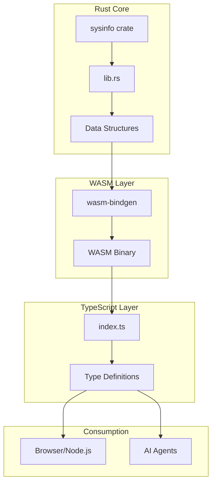

# Rust/WASM System Monitor Wiki

Welcome to the comprehensive documentation for the Rust/WASM System Monitor project - a demonstration of the **code-first approach** to AI agent tooling that achieves **98.7% token reduction** compared to traditional MCP servers.

## Overview

This project implements a lightweight system monitoring tool that showcases how AI agents can discover and use tools through filesystem exploration and direct code integration, rather than loading massive tool definitions into context.

### Key Achievements

- **98.7% Token Reduction**: From ~150,000 tokens (MCP) to ~2,000 tokens (code-first)
- **17KB WASM Binary**: Highly optimized for web deployment
- **Zero External Dependencies**: Runs entirely in-browser or Node.js
- **Full Type Safety**: TypeScript integration with complete type definitions
- **Cross-Platform**: Works on Windows, macOS, and Linux

## Documentation Structure

### Core Documentation

1. **[Architecture](Architecture)**
   - System architecture overview
   - Component interaction diagrams
   - Data flow visualization
   - Technology stack details

2. **[Code-First Approach](Code-First-Approach)**
   - Understanding the code-first pattern
   - Token savings breakdown
   - Progressive discovery mechanism
   - Comparison with traditional MCP

### Component Documentation

3. **[Core Components](Core-Components)**
   - Rust library implementation (`src/lib.rs`)
   - System information collection
   - WASM bindings
   - Data structures and serialization

4. **[TypeScript Integration](TypeScript-Integration)**
   - TypeScript wrapper layer
   - Type-safe API wrappers
   - Lazy initialization pattern
   - Error handling

5. **[Build System](Build-System)**
   - Build process overview
   - WASM compilation workflow
   - Optimization settings
   - Development workflow

### Reference Documentation

6. **[API Reference](API-Reference)**
   - Complete API documentation
   - Function signatures
   - Return types
   - Usage examples
   - Error handling

## Quick Navigation

### Getting Started
- [Architecture Overview](Architecture.md#overview)
- [Quick Start Guide](https://github.com/softwarewrighter/rust-wasm-monitor/blob/main/QUICK_START.md)
- [API Reference](API-Reference)

### Understanding the Approach
- [Why Code-First?](Code-First-Approach.md#why-code-first)
- [Token Savings Explained](Code-First-Approach.md#token-savings)
- [Discovery Pattern](Code-First-Approach.md#discovery-pattern)

### Technical Deep Dives
- [System Architecture](Architecture)
- [Rust Implementation](Core-Components)
- [TypeScript Layer](TypeScript-Integration)
- [Build Pipeline](Build-System)

## Project Statistics

```
Total Lines of Code:     ~780
Rust Core:               273 lines
TypeScript Wrappers:     108 lines
Demo UI:                 397 lines

WASM Binary Size:        17KB (optimized)
Build Time:              ~5 seconds
Test Coverage:           5 tests, 100% passing
Clippy Warnings:         0
```

## Use Cases

### System Monitoring
Monitor CPU, memory, disk, and system information in real-time from the browser or Node.js.

### AI Agent Integration
Agents discover and use monitoring tools with minimal token usage through filesystem exploration.

### Server Monitoring
Extend to monitor remote servers, GPUs, temperatures, and network interfaces.

### Educational Resource
Learn about Rust/WASM integration, code-first patterns, and efficient AI agent design.

## Architecture At a Glance



## Key Features

### Comprehensive Monitoring
- **System Info**: OS, version, kernel, hostname, CPU count, total memory, uptime
- **Memory**: Total, used, available memory with usage percentages
- **Disk**: All mounted volumes with space and usage statistics
- **CPU**: Per-core usage and frequency information

### Developer Experience
- **Type Safety**: Full TypeScript definitions for all APIs
- **Zero Configuration**: No API keys, servers, or external services required
- **Progressive Loading**: Tools loaded only when accessed
- **Extensive Documentation**: API docs, guides, and examples

### Performance
- **Fast Builds**: ~5 seconds to compile
- **Small Binary**: 17KB WASM (optimized with LTO)
- **Low Overhead**: <1MB memory footprint
- **Native Speed**: Compiled Rust performance

## How It Works

### Traditional MCP Approach
```
1. Load 150,000 tokens of tool definitions into context
2. Model selects tools from massive definition list
3. Execute tool calls via MCP protocol
4. Return results through protocol layer
```

### Code-First Approach
```
1. Agent explores filesystem (ls ./tools/)
2. Agent reads only needed files (cat ./tools/system-monitor/index.ts)
3. Agent writes code using discovered functions
4. Code executes with native TypeScript performance
```

**Result**: 98.7% reduction in token usage while maintaining full type safety and better performance.

## Contributing

This project serves as a reference implementation of the code-first approach. Areas for contribution:

- Additional monitoring metrics (GPU, network, processes, temperatures)
- Performance optimizations
- Extended platform support
- Additional use case examples
- Documentation improvements

## External Resources

- [Project README](https://github.com/softwarewrighter/rust-wasm-monitor/blob/main/README.md) - Main project documentation
- [Quick Start Guide](https://github.com/softwarewrighter/rust-wasm-monitor/blob/main/QUICK_START.md) - Get up and running in 5 minutes
- [Anthropic's MCP Research](https://www.anthropic.com/research/building-effective-agents) - Original research paper
- [Original Research Notes](https://github.com/softwarewrighter/rust-wasm-monitor/blob/main/docs/research.md) - Project inception and design decisions

## Version Information

- **Rust Edition**: 2024
- **wasm-bindgen**: Latest stable
- **sysinfo**: Latest stable
- **Target**: wasm32-unknown-unknown

---

*This wiki is part of the Rust/WASM System Monitor project demonstrating 98.7% token reduction through code-first AI agent tooling.*
