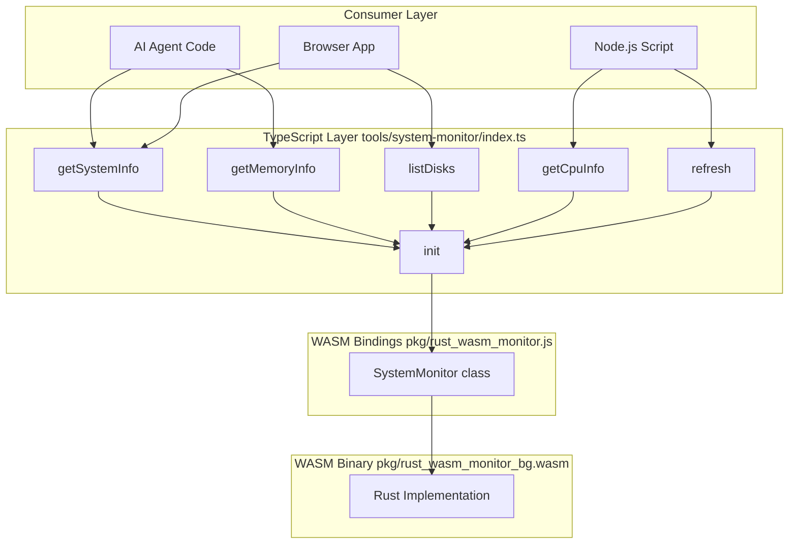
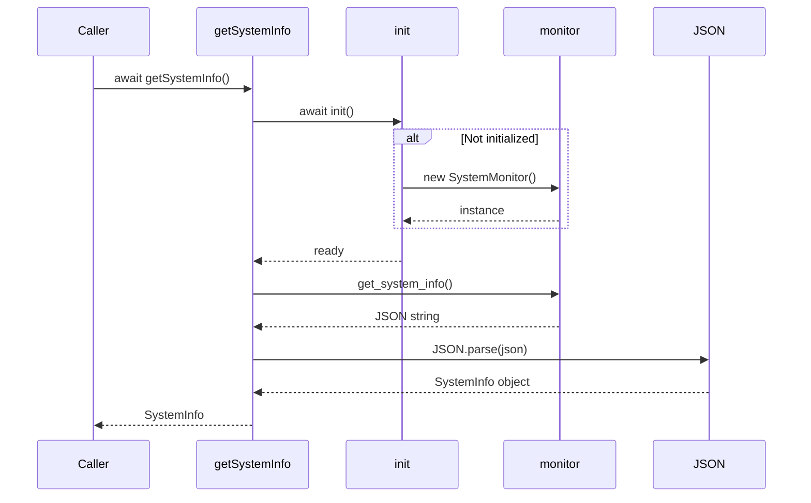
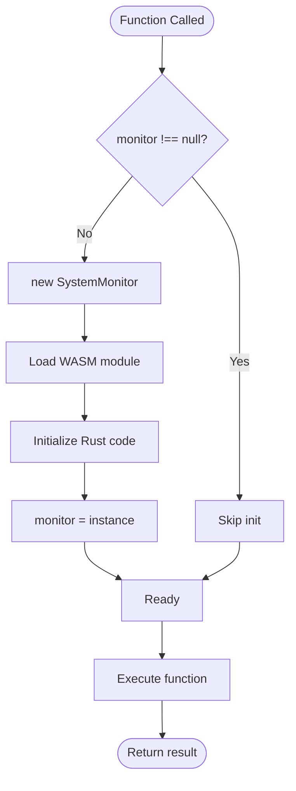

# TypeScript Integration

This document details the TypeScript integration layer that provides type-safe wrappers around the WASM bindings, enabling both direct usage and AI agent discovery.

## Table of Contents

- [Overview](#overview)
- [Integration Architecture](#integration-architecture)
- [Type Definitions](#type-definitions)
- [Function Wrappers](#function-wrappers)
- [Lazy Initialization](#lazy-initialization)
- [Usage Patterns](#usage-patterns)
- [Error Handling](#error-handling)
- [Performance Optimization](#performance-optimization)

## Overview

The TypeScript integration layer (`tools/system-monitor/index.ts`) serves as a bridge between the WASM binary and TypeScript/JavaScript consumers. It provides:

- **Type Safety**: Complete TypeScript type definitions
- **Lazy Loading**: WASM loaded only when needed (0 tokens until accessed)
- **Ergonomic API**: Clean async/await interface
- **Error Handling**: JSON parsing with type validation
- **Discovery**: File-based tool discovery for AI agents

### Key Statistics

- **File Size**: 108 lines of code
- **Functions Exported**: 5 public functions
- **Type Definitions**: 4 interfaces
- **Token Cost**: ~2,000 tokens when discovered (vs 150,000 for MCP)

## Integration Architecture

### Layer Diagram



### Module Structure

```typescript
// Import WASM types
import { SystemMonitor } from '../../pkg/rust_wasm_monitor';

// Module-level state
let monitor: SystemMonitor | null = null;

// Initialization function
export async function init(): Promise<void> { ... }

// Public API functions
export async function getSystemInfo(): Promise<SystemInfo> { ... }
export async function getMemoryInfo(): Promise<MemoryInfo> { ... }
export async function listDisks(): Promise<DiskInfo[]> { ... }
export async function getCpuInfo(): Promise<CpuInfo[]> { ... }
export async function refresh(): Promise<void> { ... }

// Type definitions
export interface SystemInfo { ... }
export interface MemoryInfo { ... }
export interface DiskInfo { ... }
export interface CpuInfo { ... }
```

## Type Definitions

All types mirror the Rust structures for consistency.

### SystemInfo

```typescript
export interface SystemInfo {
  os: string;
  os_version: string;
  kernel_version: string;
  hostname: string;
  cpu_count: number;
  total_memory: number;
  used_memory: number;
  uptime: number;
}
```

**Mapping from Rust**:
- `String` → `string`
- `usize` → `number`
- `u64` → `number`

**Note**: JavaScript numbers are 64-bit floats, safe for integers up to 2^53. For larger values, consider BigInt.

### MemoryInfo

```typescript
export interface MemoryInfo {
  total: number;
  used: number;
  available: number;
  usage_percent: number;
}
```

**Units**:
- Memory values: bytes
- Percentage: 0-100

### DiskInfo

```typescript
export interface DiskInfo {
  name: string;
  mount_point: string;
  total_space: number;
  available_space: number;
  usage_percent: number;
}
```

**Usage**:
```typescript
const disks = await listDisks();
for (const disk of disks) {
  console.log(`${disk.mount_point}: ${disk.usage_percent.toFixed(1)}%`);
}
```

### CpuInfo

```typescript
export interface CpuInfo {
  name: string;
  usage: number;
  frequency: number;
}
```

**Note**: Returns array with one entry per logical CPU core.

## Function Wrappers

All public functions follow the same pattern:

1. Ensure initialization
2. Call WASM method
3. Parse JSON result
4. Return typed object

### getSystemInfo()

```typescript
/**
 * Get basic system information
 *
 * @returns System info object with OS, memory, uptime, etc.
 */
export async function getSystemInfo(): Promise<SystemInfo> {
  await init();
  const json = monitor!.get_system_info();
  return JSON.parse(json);
}
```

**Flow**:


**Usage**:
```typescript
const info = await getSystemInfo();
console.log(`Running ${info.os} ${info.os_version}`);
console.log(`Hostname: ${info.hostname}`);
console.log(`CPUs: ${info.cpu_count}`);
console.log(`Memory: ${(info.total_memory / 1024**3).toFixed(2)} GB`);
```

### getMemoryInfo()

```typescript
/**
 * Get memory usage information
 *
 * @returns Memory info with total, used, available, and usage percentage
 */
export async function getMemoryInfo(): Promise<MemoryInfo> {
  await init();
  const json = monitor!.get_memory_info();
  return JSON.parse(json);
}
```

**Usage**:
```typescript
const mem = await getMemoryInfo();
if (mem.usage_percent > 90) {
  console.warn(`High memory usage: ${mem.usage_percent.toFixed(1)}%`);
}
```

### listDisks()

```typescript
/**
 * List all disk mounts
 *
 * @returns Array of disk information objects
 */
export async function listDisks(): Promise<DiskInfo[]> {
  await init();
  const json = monitor!.list_disks();
  return JSON.parse(json);
}
```

**Usage**:
```typescript
const disks = await listDisks();
const lowSpace = disks.filter(d => d.usage_percent > 80);
for (const disk of lowSpace) {
  console.warn(`${disk.mount_point} is ${disk.usage_percent.toFixed(1)}% full`);
}
```

### getCpuInfo()

```typescript
/**
 * Get CPU information
 *
 * @returns Array of CPU info objects with usage and frequency
 */
export async function getCpuInfo(): Promise<CpuInfo[]> {
  await init();
  const json = monitor!.get_cpu_info();
  return JSON.parse(json);
}
```

**Usage**:
```typescript
const cpus = await getCpuInfo();
const avgUsage = cpus.reduce((sum, cpu) => sum + cpu.usage, 0) / cpus.length;
console.log(`Average CPU usage: ${avgUsage.toFixed(1)}%`);
```

### refresh()

```typescript
/**
 * Refresh all system data
 */
export async function refresh(): Promise<void> {
  await init();
  monitor!.refresh();
}
```

**Usage**:
```typescript
// Force refresh before reading
await refresh();
const info = await getSystemInfo();
```

**Note**: Most `get*` methods auto-refresh, so explicit refresh is rarely needed.

## Lazy Initialization

The initialization pattern ensures WASM is loaded only when first accessed.

### Implementation

```typescript
let monitor: SystemMonitor | null = null;

/**
 * Initialize the system monitor
 * Lazy-loaded only when needed - 0 tokens until this function is called
 */
export async function init(): Promise<void> {
  if (!monitor) {
    monitor = new SystemMonitor();
  }
}
```

### Benefits

1. **Zero Token Cost**: File exists but costs 0 tokens until read
2. **Fast Imports**: No initialization at import time
3. **On-Demand Loading**: WASM loaded only when first function called
4. **Singleton Pattern**: Single monitor instance shared across calls

### Initialization Flow



### Usage Implications

```typescript
// First call - loads WASM
const info1 = await getSystemInfo();  // ~100ms

// Subsequent calls - WASM already loaded
const info2 = await getSystemInfo();  // <10ms
const mem = await getMemoryInfo();    // <10ms
```

## Usage Patterns

### Pattern 1: Simple Monitoring

```typescript
import { getSystemInfo, getMemoryInfo } from './tools/system-monitor';

async function checkSystem() {
  const sys = await getSystemInfo();
  const mem = await getMemoryInfo();

  console.log(`System: ${sys.os} ${sys.os_version}`);
  console.log(`Memory: ${mem.usage_percent.toFixed(1)}% used`);
}

checkSystem();
```

### Pattern 2: Alert System

```typescript
import { getMemoryInfo, listDisks } from './tools/system-monitor';

async function checkAlerts() {
  const mem = await getMemoryInfo();
  if (mem.usage_percent > 90) {
    alert('Critical: Memory usage above 90%');
  }

  const disks = await listDisks();
  for (const disk of disks) {
    if (disk.usage_percent > 90) {
      alert(`Critical: ${disk.mount_point} above 90% full`);
    }
  }
}

setInterval(checkAlerts, 60000); // Check every minute
```

### Pattern 3: Dashboard Data Collection

```typescript
import {
  getSystemInfo,
  getMemoryInfo,
  listDisks,
  getCpuInfo,
  refresh
} from './tools/system-monitor';

async function collectMetrics() {
  await refresh(); // Ensure fresh data

  return {
    system: await getSystemInfo(),
    memory: await getMemoryInfo(),
    disks: await listDisks(),
    cpus: await getCpuInfo(),
    timestamp: Date.now()
  };
}

// Update dashboard every 2 seconds
setInterval(async () => {
  const metrics = await collectMetrics();
  updateDashboard(metrics);
}, 2000);
```

### Pattern 4: AI Agent Discovery

```typescript
// Agent explores filesystem
// $ ls ./tools/
// > system-monitor/

// Agent reads API
// $ cat ./tools/system-monitor/index.ts
// > (sees function signatures and types)

// Agent writes code
import { getSystemInfo, getMemoryInfo } from './tools/system-monitor';

async function analyzeSystem() {
  const sys = await getSystemInfo();
  const mem = await getMemoryInfo();

  // Process data locally - not returned to model context
  const analysis = {
    os: sys.os,
    memoryStatus: mem.usage_percent > 80 ? 'high' : 'normal',
    uptime: sys.uptime
  };

  // Only summary returned to context
  return analysis;
}
```

## Error Handling

### JSON Parsing Errors

The Rust code returns well-formed JSON, but TypeScript adds safety:

```typescript
export async function getSystemInfo(): Promise<SystemInfo> {
  await init();
  const json = monitor!.get_system_info();

  try {
    return JSON.parse(json);
  } catch (err) {
    console.error('Failed to parse system info:', err);
    throw new Error('Invalid system info JSON');
  }
}
```

### Type Validation

For runtime type validation, consider using a library like `zod`:

```typescript
import { z } from 'zod';

const SystemInfoSchema = z.object({
  os: z.string(),
  os_version: z.string(),
  kernel_version: z.string(),
  hostname: z.string(),
  cpu_count: z.number(),
  total_memory: z.number(),
  used_memory: z.number(),
  uptime: z.number()
});

export async function getSystemInfo(): Promise<SystemInfo> {
  await init();
  const json = monitor!.get_system_info();
  const data = JSON.parse(json);
  return SystemInfoSchema.parse(data); // Throws if invalid
}
```

### WASM Load Errors

```typescript
export async function init(): Promise<void> {
  if (!monitor) {
    try {
      monitor = new SystemMonitor();
    } catch (err) {
      console.error('Failed to initialize WASM:', err);
      throw new Error('WASM initialization failed');
    }
  }
}
```

## Performance Optimization

### Minimize Calls

```typescript
// Bad - multiple calls
const os = (await getSystemInfo()).os;
const hostname = (await getSystemInfo()).hostname;

// Good - single call
const info = await getSystemInfo();
const os = info.os;
const hostname = info.hostname;
```

### Batch Operations

```typescript
// Collect all data in parallel
async function getAllMetrics() {
  const [system, memory, disks, cpus] = await Promise.all([
    getSystemInfo(),
    getMemoryInfo(),
    listDisks(),
    getCpuInfo()
  ]);

  return { system, memory, disks, cpus };
}
```

### Avoid Unnecessary Refreshes

```typescript
// refresh() is usually unnecessary
// Most methods auto-refresh internally

// Only use refresh() when you need to ensure
// all data is from the exact same moment
await refresh();
const snapshot = await getAllMetrics();
```

### Caching

```typescript
let cachedInfo: SystemInfo | null = null;
let cacheTime = 0;
const CACHE_DURATION = 5000; // 5 seconds

export async function getCachedSystemInfo(): Promise<SystemInfo> {
  const now = Date.now();
  if (cachedInfo && now - cacheTime < CACHE_DURATION) {
    return cachedInfo;
  }

  cachedInfo = await getSystemInfo();
  cacheTime = now;
  return cachedInfo;
}
```

## Advanced Patterns

### Streaming Updates

```typescript
import { getMemoryInfo } from './tools/system-monitor';

async function* memoryStream(intervalMs: number) {
  while (true) {
    yield await getMemoryInfo();
    await new Promise(resolve => setTimeout(resolve, intervalMs));
  }
}

// Usage
for await (const mem of memoryStream(1000)) {
  console.log(`Memory: ${mem.usage_percent.toFixed(1)}%`);
  if (mem.usage_percent > 95) break;
}
```

### Observable Pattern

```typescript
import { Observable } from 'rxjs';
import { getSystemInfo } from './tools/system-monitor';

const systemInfo$ = new Observable(subscriber => {
  const interval = setInterval(async () => {
    try {
      const info = await getSystemInfo();
      subscriber.next(info);
    } catch (err) {
      subscriber.error(err);
    }
  }, 2000);

  return () => clearInterval(interval);
});

systemInfo$.subscribe(info => {
  console.log(`Uptime: ${info.uptime}s`);
});
```

### Type Guards

```typescript
export function isSystemInfo(obj: unknown): obj is SystemInfo {
  return (
    typeof obj === 'object' &&
    obj !== null &&
    'os' in obj &&
    'hostname' in obj &&
    'cpu_count' in obj
  );
}

// Usage
const data = JSON.parse(someJson);
if (isSystemInfo(data)) {
  console.log(data.os); // Type-safe
}
```

## Integration with Build Tools

### Webpack

```javascript
// webpack.config.js
module.exports = {
  experiments: {
    asyncWebAssembly: true
  },
  module: {
    rules: [
      {
        test: /\.wasm$/,
        type: 'webassembly/async'
      }
    ]
  }
};
```

### Vite

```javascript
// vite.config.js
import { defineConfig } from 'vite';
import wasm from 'vite-plugin-wasm';

export default defineConfig({
  plugins: [wasm()]
});
```

### Rollup

```javascript
// rollup.config.js
import wasm from '@rollup/plugin-wasm';

export default {
  plugins: [wasm()]
};
```

## Related Documentation

- [Architecture](Architecture) - System architecture
- [Core Components](Core-Components) - Rust implementation details
- [API Reference](API-Reference) - Complete API documentation
- [Code-First Approach](Code-First-Approach) - Discovery pattern

---

[Back to Home](Home)
